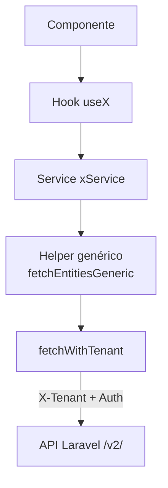
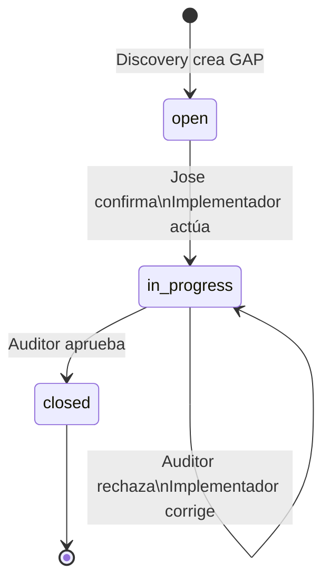
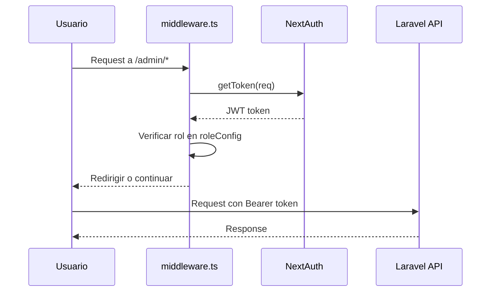
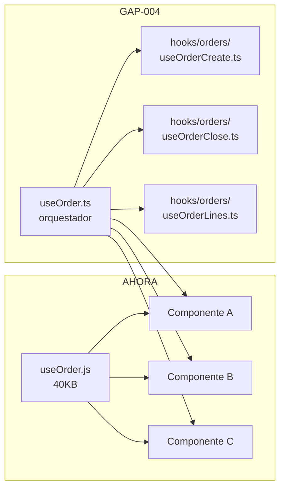

# Skill: Napkin

## Categoría
Visualización

## Cuándo se activa

Cuando el usuario dice: "dibuja", "diagrama", "visualiza", "sketch", "napkin", "muéstrame el flujo", "diagram this", "cómo se relacionan", "esquema", "arquitectura visual", "flowchart", "sequence diagram".

---

## Qué hace

Genera diagramas rápidos — como un sketch en una servilleta. No son diagramas de arquitectura empresarial perfectos; son esquemas claros y útiles que comunican la idea en segundos.

Usa **Mermaid** por defecto (se renderiza en GitHub, Notion, VS Code, GitLab). Si el contexto no soporta Mermaid, usa ASCII.

---

## Tipos de diagrama disponibles

| Tipo | Cuándo usarlo | Sintaxis Mermaid |
|---|---|---|
| Flowchart | Flujos de datos, decisiones, procesos | `flowchart TD` |
| Sequence | Comunicación entre sistemas/componentes | `sequenceDiagram` |
| Component | Relaciones entre módulos | `graph LR` |
| State machine | Estados de UI, ciclo de vida | `stateDiagram-v2` |
| ER | Modelos de datos | `erDiagram` |
| Timeline | Roadmap, fases | `timeline` |

---

## Proceso

### 1. Identificar qué dibujar

Preguntar si no está claro: ¿flujo de datos? ¿arquitectura de componentes? ¿secuencia de llamadas? ¿estados de UI?

### 2. Elegir el tipo

Para este proyecto, los más útiles:
- **Flujo de datos** → flowchart (Componente → Hook → Service → fetchWithTenant → API)
- **Llamadas entre sistemas** → sequenceDiagram (Frontend ↔ Laravel ↔ BD)
- **Relaciones entre módulos** → graph LR
- **Estados de un formulario/proceso** → stateDiagram-v2

### 3. Dibujar en Mermaid

Mantener simple: máximo 10-12 nodos. Si es más complejo, dividir en dos diagramas.

### 4. Añadir contexto mínimo

Una línea antes del diagrama explicando qué representa.

---

## Ejemplos reales del proyecto

### Flujo de datos de PesquerApp



### Ciclo GAP



### Autenticación NextAuth



### Estructura de hooks gigantes (problema actual)



---

## Output

```
[Línea de contexto: qué representa el diagrama]

\`\`\`mermaid
[código del diagrama]
\`\`\`

[Opcional: nota de 1 línea si algo del diagrama necesita aclaración]
```

Si el diagrama es ASCII (porque Mermaid no aplica):
```
[contexto]

┌──────────┐     ┌──────────┐
│ Módulo A │────▶│ Módulo B │
└──────────┘     └──────────┘
```
