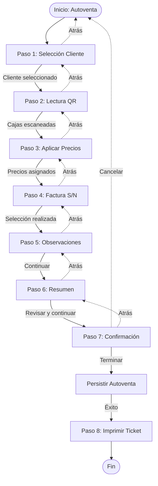

# Autoventa rol Comercial — Especificación e implementación

**Estado**: Especificación  
**Última actualización**: 2026-02-18

---

## 1. Objetivo y alcance

### 1.1 Descripción

El apartado **Autoventa** permite al rol comercial realizar ventas rápidas mediante un flujo guiado paso a paso: selección de cliente (con opción de creación in situ), escaneo de cajas por QR, asignación de precios, configuración de facturación, observaciones, revisión y confirmación, e impresión de ticket.

Este flujo está diseñado para ser usado principalmente en **dispositivos móviles** durante la actividad comercial en campo, pero también debe funcionar correctamente en **versión desktop** para gestión desde oficina.

### 1.2 Orientación y diseño

- **Mobile-first**: El diseño original está orientado casi al 100% a versión móvil, con pantallas verticales, botones grandes y accesibles, e indicadores de progreso visuales.
- **Versión desktop**: El mismo flujo debe adaptarse a pantallas grandes, aprovechando el espacio horizontal sin perder la claridad del proceso paso a paso.
- **Rol**: Solo accesible para usuarios con rol **comercial** (ya existe segmento `/comercial` y layout en [src/app/comercial](src/app/comercial)).

### 1.3 Referencias visuales

Las capturas de pantalla de la implementación anterior sirven como referencia visual del flujo esperado:

- **Paso 1**: Selección de cliente con fecha (imagen: Autoventa con selector de fecha y dropdown de cliente)
- **Paso 2**: Escáner QR (imagen: Escaner QR con botón "Iniciar Escaneo" y área de escaneo)
- **Paso 3**: Lista de cajas escaneadas (imagen: Escaner QR con estado vacío "No hay cajas escaneadas")
- **Paso 4**: Factura sí/no (imagen: Factura con toggle switch)
- **Paso 5**: Observaciones (imagen: Observaciones con campo de texto)
- **Paso 6**: Resumen (imagen: Resumen con ticket mostrando cliente, fecha, factura, tabla de productos)
- **Paso 7**: Confirmación (imagen: Confirmación con total y botones Cancelar/Terminar)
- **Paso 8**: Impresión de ticket (después de terminar)

---

## 2. Workflow detallado

El flujo de Autoventa consta de **8 pasos** que deben completarse secuencialmente. El usuario puede navegar hacia atrás para corregir información, pero no puede saltar pasos.

### 2.1 Tabla de pasos

| Paso | Nombre | Descripción | Validación / Requisitos | Notas |
|------|--------|-------------|-------------------------|-------|
| **1** | **Selección de cliente** | Selector de cliente existente (dropdown/combobox) + botón "Nuevo cliente" para creación in situ rápida. Selector de fecha para la autoventa (formato: DD/MM/YYYY, tipo "pill"). | Cliente **obligatorio**. Fecha por defecto: fecha actual. Si se selecciona "Nuevo cliente", se abre modal/sheet con formulario con un único campo obligatorio: **nombre** del cliente; al guardar exitosamente, el cliente se selecciona automáticamente y se continúa al siguiente paso. | El selector de fecha debe permitir cambiar la fecha de la autoventa. No se piden más datos (NIF, dirección, etc.) para no hacer el flujo más laborioso. |
| **2** | **Lectura de cajas por QR** | Escaneo de códigos QR de cajas mediante cámara del dispositivo o entrada manual. Lista de cajas escaneadas con opción "Eliminar todo". Indicador visual de progreso (puntos de paginación). | Al menos **una caja escaneada** para avanzar (o permitir 0 y definir comportamiento en paso resumen). Formato QR: a documentar (ver sección 7.1). Cada caja escaneada debe mostrar: producto, peso (si aplica), código escaneado. | El botón "Iniciar Escaneo" activa la cámara. Si no hay cajas escaneadas, mostrar estado vacío con mensaje "No hay cajas escaneadas". |
| **3** | **Aplicar precio por producto** | Asignar precio a cada producto único (agrupación por producto tras escaneo). Tabla o lista con: producto, cantidad de cajas, peso total, precio unitario, subtotal. | Precio **obligatorio** por línea/producto. El precio puede ser por unidad (caja) o por peso (kg), según configuración o lógica de negocio. Total calculado automáticamente. | Si hay múltiples cajas del mismo producto, se agrupan en una sola línea con cantidad y peso total. |
| **4** | **Factura sí/no** | Toggle switch o selector: "Con factura" o "Solo recibo". Actualmente se refleja como texto en observaciones de contabilidad ("Con factura" / "Sin factura"). | Selección **obligatoria**. El valor se persiste en observaciones de contabilidad del pedido/autoventa o en campo dedicado si se define entidad autoventa (ver sección 5). | El toggle debe tener estados claros visualmente (ON/OFF o Sí/No). |
| **5** | **Observaciones** | Campo de texto libre (textarea) con placeholder "Introduce alguna observación...". Información adicional sobre la autoventa. | Campo **opcional**. Sin límite de caracteres o con límite razonable (ej. 500-1000 caracteres). | Las observaciones se añaden al pedido/autoventa junto con la indicación de factura sí/no. |
| **6** | **Resumen** | Pantalla de revisión antes de confirmar: fecha, nombre del cliente, factura sí/no, tabla detallada (producto, cajas, peso, precio), total calculado. Botones "Atrás" y "Terminar". | Solo **lectura**; no se puede editar desde aquí. El total debe coincidir con la suma de subtotales. Formato de ticket visual (similar a ticket impreso). | El resumen muestra todos los datos que se van a persistir. En resumen y ticket, del cliente solo se muestra el nombre. Si hay errores, el usuario debe volver atrás. |
| **7** | **Confirmación** | Mensaje de éxito: "Has completado todos los datos para generar una autoventa." Total destacado (ej. "0,00 €" o el total calculado). Acciones: botón "Cancelar" (rojo) y botón "Terminar" (blanco/primario). | Al pulsar "Terminar", se persiste la autoventa (pedido con `buyerReference: "Autoventa"` o entidad autoventa según modelo elegido). Tras persistir exitosamente, se muestra opción de imprimir ticket. | Si hay error al persistir, mostrar mensaje de error y permitir reintentar o cancelar. |
| **8** | **Imprimir ticket** | Tras terminar exitosamente, ofrecer impresión de ticket. El ticket muestra: fecha, **nombre del cliente** (única información del cliente; no NIF ni dirección), factura sí/no, tabla de productos con cajas/peso/precio, total. | Reutilizar patrón de impresión existente ([usePrintElement](src/hooks/usePrintElement.ts)). El ticket debe ser imprimible por navegador (window.print) o enviarse a impresora térmica según requisitos (ver sección 7.3). | El contenido del ticket debe coincidir con el resumen del paso 6. |

### 2.2 Flujo de navegación



### 2.3 Indicadores de progreso

Cada paso debe mostrar un indicador visual de progreso (puntos de paginación) que indique:
- Paso actual (punto destacado/activo)
- Pasos completados (puntos con check o diferente estilo)
- Pasos pendientes (puntos grises/inactivos)

El número total de pasos puede variar según la implementación (ej. si se combinan pasos), pero el flujo debe mantenerse claro.

---

## 3. Requisitos de UI

### 3.1 Mobile (prioritario)

- **Layout**: Pantalla vertical completa, sin sidebar visible durante el flujo (el layout comercial puede ocultar sidebar en móvil o usar bottom navigation).
- **Componentes**:
  - Selector de fecha: estilo "pill" con icono de calendario, fácil de tocar.
  - Dropdown/Combobox de cliente: campo grande, placeholder claro, botón "+ Nuevo cliente" visible.
  - Botón "Iniciar Escaneo": grande, centrado, con icono de cámara/QR.
  - Área de escaneo: marco visual que indique dónde posicionar el código QR.
  - Lista de cajas: cards o lista con información clara (producto, peso, código).
  - Tabla de precios: filas grandes, inputs numéricos con formato de moneda.
  - Toggle factura: switch grande y claro (ON/OFF).
  - Campo observaciones: textarea con altura suficiente.
  - Botones navegación: circulares grandes en esquinas inferiores (Atrás ←, Siguiente →).
  - Botones acción: rectangulares grandes (Cancelar, Terminar, Imprimir).
- **Ilustraciones**: Mantener ilustraciones por paso si aportan claridad (referencia a capturas).
- **Tema**: Coherente con dark mode si aplica; usar componentes [shadcn](src/components/ui) existentes.

### 3.2 Desktop (adaptación)

- **Layout**: Wizard en columna central (max-width aprox. 800-1000px) o formulario en dos columnas donde tenga sentido (ej. paso de precios: lista productos izquierda, formulario precio derecha).
- **Sin marco móvil**: No mostrar el outline de smartphone; contenido directo en la página.
- **Componentes**:
  - Selector de fecha: puede ser DatePicker estándar de shadcn.
  - Combobox cliente: mismo componente pero con más espacio.
  - Escaneo QR: área más grande, opción de entrada manual más visible.
  - Tabla de precios: tabla completa con columnas (Producto | Cajas | Peso | Precio Unit. | Subtotal | Acciones).
  - Botones navegación: pueden ser botones estándar en lugar de circulares, en barra inferior o superior.
- **Espaciado**: Aprovechar ancho para mejor legibilidad; no comprimir información.

### 3.3 Tema y componentes

- **Tema**: Coherente con el resto de la aplicación (dark mode si está habilitado).
- **Componentes base**: Reutilizar componentes de [src/components/ui](src/components/ui) (Button, Input, Select, Textarea, DatePicker, etc.).
- **Estilos**: Seguir el design system existente; no crear estilos ad-hoc salvo necesidades específicas del flujo.

---

## 4. Encaje en el proyecto actual

### 4.1 Rutas

- **Ruta principal**: `GET /comercial/autoventa` (página inicial del flujo).
- **Rutas por paso** (opcional): Si se implementa navegación por URL, ej. `/comercial/autoventa/nueva`, `/comercial/autoventa/paso/2`, etc. Por defecto, el estado del flujo puede manejarse en memoria (React state) y la navegación ser interna.
- **Actualizar configs**:
  - [src/configs/roleRoutesConfig.js](src/configs/roleRoutesConfig.js): Añadir `comercialRoutes.autoventa = '/comercial/autoventa'`.
  - [src/configs/navgationConfig.js](src/configs/navgationConfig.js): Añadir ítem "Autoventa" con `href: '/comercial/autoventa'` y `allowedRoles: ["comercial"]`.

### 4.2 Layout

- **Reutilizar**: [ComercialLayoutClient](src/app/comercial/ComercialLayoutClient.jsx) y [ResponsiveLayout](src/components/Admin/Layout/ResponsiveLayout).
- **Sidebar**: El comercial verá "Inicio" y "Autoventa" en la navegación.
- **Protección**: Ya cubierto por `ComercialRouteProtection` y middleware; solo rol comercial puede acceder.

### 4.3 Reutilización de componentes y servicios

#### 4.3.1 Clientes

- **Selector**: Reutilizar [getCustomersOptions](src/services/customerService.ts) y componente [Combobox](src/components/Shadcn/Combobox) o Select estándar.
- **Creación rápida**: Formulario de creación rápida con **un único campo**: nombre del cliente. No se solicitan NIF, dirección ni otros datos para mantener el flujo ágil. Componente `CreateCustomerQuickForm` con un solo input (nombre); el backend debe aceptar `POST /api/v2/customers` con payload mínimo `{ name }` (el comercial asignado puede inferirse del token).
- **Filtrado**: Si el comercial solo debe ver clientes asignados a él, el backend debe filtrar por `salesperson` en `GET /api/v2/customers/options` según el token del usuario.

#### 4.3.2 Cajas y escaneo QR

- **Formato QR**: Verificar si el formato es el mismo que en [usePallet.js](src/hooks/usePallet.js) (GS1-128 con estructura `01{GTIN}3100{peso}10{lote}`) o si es un formato específico de autoventa (ej. solo ID de caja).
- **Endpoint de escaneo**: Si las cajas existen en el sistema, puede existir (o crearse) un endpoint tipo:
  - `GET /api/v2/boxes/by-code?code={qr_code}` que devuelva `{ product, netWeight, lot, ... }`
  - O `POST /api/v2/autoventa/scan` con payload `{ code: "..." }` que devuelva la misma información.
- **Si no hay endpoint**: El frontend puede parsear el QR según formato conocido y crear objetos temporales en memoria hasta persistir la autoventa.

#### 4.3.3 Impresión

- **Patrón**: Reutilizar [usePrintElement](src/hooks/usePrintElement.ts) y el patrón de [ReceptionReciboPrintContent](src/components/Admin/RawMaterialReceptions/ReceptionPrintDialog/ReceptionReciboPrintContent.js):
  - Contenido del ticket en un `div` con `id="autoventa-ticket-print"` y clases `hidden print:block`.
  - Botón "Imprimir ticket" que llama a `onPrint()` del hook.
  - Estilos CSS con `@media print` para formato de ticket (tamaño, márgenes, tipografía).
- **Contenido del ticket**: Fecha, **nombre del cliente** (solo el nombre; no incluir NIF, dirección ni otros datos del cliente), factura sí/no, tabla de productos (producto, cajas, peso, precio, subtotal), total, observaciones (si hay).

---

## 5. API a implementar en backend

### 5.1 Endpoints existentes (reutilizar)

- **Clientes**:
  - `GET /api/v2/customers/options` — Lista de clientes para selector (ya existe).
  - `POST /api/v2/customers` — Crear cliente (ya existe); para creación rápida en autoventa, aceptar payload mínimo: `{ name }`. El comercial se asocia por token; no se envían NIF ni otros campos.
- **Productos**: Endpoints de productos ya existen si se necesitan para validar/obtener info de productos tras escaneo.

### 5.2 Endpoints nuevos a implementar

#### 5.2.1 Escaneo de cajas

**Opción A: Endpoint genérico de cajas**
```http
GET /api/v2/boxes/by-code?code={qr_code}
```
**Headers**: `Authorization: Bearer {token}`, `X-Tenant: {subdomain}`

**Response (200)**:
```json
{
  "id": 123,
  "product": {
    "id": 45,
    "name": "Merluza",
    "code": "MER-001"
  },
  "netWeight": 12.50,
  "lot": "LOT-2024-001",
  "scannedCode": "01...3100...10..."
}
```

**Response (404)**: Caja no encontrada o código inválido.

**Opción B: Endpoint específico de autoventa**
```http
POST /api/v2/autoventa/scan
```
**Body**:
```json
{
  "code": "01...3100...10..."
}
```

**Response**: Mismo formato que Opción A.

**Recomendación**: Opción A es más genérica y reutilizable; Opción B permite lógica específica de autoventa (ej. validar que la caja esté disponible para venta).

#### 5.2.2 Crear autoventa / pedido

**Opción A: Usar endpoint de pedidos existente**
```http
POST /api/v2/orders
```
**Body**:
```json
{
  "customer_id": 10,
  "entry_date": "2026-02-18",
  "load_date": "2026-02-18",
  "buyer_reference": "Autoventa",
  "salesperson_id": 5,
  "planned_products": [
    {
      "product_id": 45,
      "quantity": 3,
      "net_weight": 37.50,
      "unit_price": 15.00,
      "total_price": 562.50
    }
  ],
  "accounting_notes": "Con factura\nObservaciones adicionales...",
  "production_notes": "",
  "transportation_notes": ""
}
```

**Ventajas**: Reutiliza modelo existente, aparece en listado de pedidos.

**Desventajas**: Difícil filtrar autoventas vs pedidos normales; `buyer_reference` es texto libre, puede haber inconsistencias.

**Opción B: Endpoint específico de autoventa**
```http
POST /api/v2/autoventas
```
**Body**:
```json
{
  "customer_id": 10,
  "date": "2026-02-18",
  "invoice_required": true,
  "observations": "Observaciones adicionales...",
  "items": [
    {
      "product_id": 45,
      "boxes_count": 3,
      "total_weight": 37.50,
      "unit_price": 15.00,
      "subtotal": 562.50
    }
  ]
}
```

**Response (201)**:
```json
{
  "id": 789,
  "customer": { "id": 10, "name": "Cliente X" },
  "date": "2026-02-18",
  "invoice_required": true,
  "total_amount": 562.50,
  "created_at": "2026-02-18T10:30:00Z"
}
```

**Ventajas**: Modelo específico, fácil filtrar y reportar, puede tener campos propios (ej. `invoice_required` booleano).

**Desventajas**: Requiere nueva tabla/entidad en BD, más trabajo inicial.

**Recomendación**: Valorar Opción B para una implementación más robusta (ver sección 6).

### 5.3 Filtrado por comercial

Todas las peticiones deben incluir el token del usuario comercial. El backend debe:
- Asociar automáticamente el `salesperson_id` del usuario autenticado a la autoventa/pedido.
- Filtrar clientes en `GET /api/v2/customers/options` para mostrar solo los asignados al comercial (si aplica política de negocio).
- Validar que el comercial tenga permisos para crear autoventas.

---

## 6. Modelo de datos y alternativas

### 6.1 Situación actual (app deprecada)

En la implementación anterior, al terminar una autoventa se creaba un **pedido normal** (`Order`) con:
- `buyer_reference: "Autoventa"` (texto fijo)
- Resto de campos como un pedido estándar (cliente, fecha, productos, precios, observaciones)

**Ventajas**:
- Reutiliza modelo existente
- Aparece en listado de pedidos
- Sin cambios en BD

**Desventajas**:
- Difícil distinguir autoventas de pedidos normales (depende de texto en `buyer_reference`)
- No hay campos específicos (ej. `invoice_required` booleano)
- Puede haber inconsistencias si alguien crea un pedido manual con `buyer_reference: "Autoventa"`

### 6.2 Alternativa más robusta

#### Opción A: Tipo de pedido
Añadir campo `order_type` o `order_source` al modelo `Order`:
- Valores: `"standard"`, `"autoventa"`, etc.
- Filtrar por `order_type = "autoventa"` en queries
- Mantener misma tabla, solo añadir campo

**Ventajas**: Fácil implementar, mantiene modelo unificado.

**Desventajas**: Sigue mezclando conceptos en misma entidad.

#### Opción B: Entidad Autoventa separada
Crear nueva entidad `Autoventa` (o `SelfSale`) con:
- Relación a `Customer`
- Campo `invoice_required` (booleano)
- Campo `date`
- Relación a `Salesperson` (del usuario que la crea)
- Líneas (`AutoventaItem`) con producto, cantidad, peso, precio
- Campo `observations`

**Ventajas**:
- Modelo específico y claro
- Fácil filtrar y reportar autoventas
- Puede evolucionar independientemente (ej. estados específicos, integraciones)
- Mejor trazabilidad

**Desventajas**:
- Requiere nueva tabla/entidad en BD
- Más trabajo inicial de backend
- Posible duplicación de lógica si autoventa y pedido comparten comportamiento

**Recomendación**: Valorar Opción B si se prevé que autoventas necesiten funcionalidad específica (reportes, estados, integraciones) o si se quiere mantener separación clara de conceptos. Si solo es un "pedido rápido", Opción A puede ser suficiente.

### 6.3 Decisión pendiente

**Antes de implementar backend**, decidir:
1. ¿Persistir como pedido con convención (`buyer_reference: "Autoventa"`)?
2. ¿Añadir tipo de pedido (`order_type: "autoventa"`)?
3. ¿Crear entidad Autoventa separada?

El documento debe reflejar esta decisión una vez tomada.

---

## 7. Preguntas abiertas para afinar

### 7.1 Formato del código QR

- ¿El formato QR de las cajas en autoventa es el mismo que en palets (GS1-128 con estructura `01{GTIN}3100{peso_centésimas}10{lote}`)?
- ¿O es un formato más simple (ej. solo ID de caja, código de barras interno)?
- ¿El QR incluye peso o solo identifica la caja y el peso se obtiene de BD?

**Impacto**: Define cómo parsear el QR en frontend y qué endpoint necesita el backend.

### 7.2 Campos mínimos para "Nuevo cliente"

**Decisión**: En creación in situ rápida solo se introduce el **nombre** del cliente. No se piden NIF, dirección, forma de pago ni otros campos para no hacer el flujo más laborioso. El backend debe aceptar `POST /api/v2/customers` con solo `name` y asignar comercial desde el token si aplica.

**Impacto**: Define el payload mínimo para `POST /api/v2/customers` en autoventa.

### 7.3 Impresión del ticket

- ¿El ticket se imprime solo por navegador (`window.print`) o hay requisito de impresora térmica/integrada?
- ¿Hay formato específico de ticket (tamaño, márgenes, tipografía) o se usa formato estándar A4?
- ¿El ticket debe incluir logo de la empresa, datos fiscales, etc.?

**Impacto**: Define si se necesita integración con impresoras térmicas o si basta con CSS de impresión.

### 7.4 Existencia de cajas en el sistema

- ¿Las cajas escaneadas deben existir previamente en el sistema (p. ej. cajas de almacén que se están vendiendo)?
- ¿O la autoventa puede registrar "producto + cantidad/peso" sin que exista una caja física en BD (ej. venta directa de producto sin pasar por almacén)?

**Impacto**: Define si el endpoint de escaneo debe buscar cajas existentes o solo validar producto/peso.

### 7.5 Decisión final del modelo de datos

- ¿Se implementa como pedido con convención, tipo de pedido, o entidad autoventa? (ver sección 6)

**Impacto**: Define la estructura de BD y los endpoints del backend.

---

## 8. Diagrama de flujo completo

```mermaid
flowchart TD
    Start([Usuario comercial<br/>accede a Autoventa]) --> CheckAuth{¿Rol comercial?}
    CheckAuth -->|No| Unauthorized[/unauthorized]
    CheckAuth -->|Sí| Paso1[Paso 1: Selección Cliente<br/>+ Fecha]
    
    Paso1 --> SelectCliente{¿Cliente existe?}
    SelectCliente -->|Sí| Paso2[Paso 2: Lectura QR]
    SelectCliente -->|No| CreateCliente[Crear Cliente<br/>Formulario rápido]
    CreateCliente -->|Guardar| SelectCliente
    
    Paso2 --> ScanQR[Escanear Cajas<br/>o Entrada Manual]
    ScanQR --> ValidateQR{¿QR válido?}
    ValidateQR -->|No| ErrorQR[Error: QR inválido]
    ErrorQR --> ScanQR
    ValidateQR -->|Sí| AddBox[Añadir a Lista<br/>Cajas Escaneadas]
    AddBox --> MoreBoxes{¿Más cajas?}
    MoreBoxes -->|Sí| ScanQR
    MoreBoxes -->|No| Paso3[Paso 3: Aplicar Precios<br/>por Producto]
    
    Paso3 --> SetPrices[Asignar Precio<br/>a cada Producto]
    SetPrices --> ValidatePrices{¿Todos con precio?}
    ValidatePrices -->|No| SetPrices
    ValidatePrices -->|Sí| Paso4[Paso 4: Factura S/N<br/>Toggle]
    
    Paso4 --> SelectInvoice{¿Con factura?}
    SelectInvoice --> Paso5[Paso 5: Observaciones<br/>Texto libre]
    
    Paso5 --> Paso6[Paso 6: Resumen<br/>Revisión Completa]
    
    Paso6 --> Review{¿Datos correctos?}
    Review -->|No| Back[Volver atrás<br/>a paso correspondiente]
    Back --> Paso1
    Review -->|Sí| Paso7[Paso 7: Confirmación<br/>Total y Acciones]
    
    Paso7 --> Action{¿Acción?}
    Action -->|Cancelar| Cancel[Cancelar Autoventa<br/>Volver a Inicio]
    Cancel --> Start
    Action -->|Terminar| Persist[Persistir Autoventa<br/>POST /api/v2/...]
    
    Persist --> PersistResult{¿Éxito?}
    PersistResult -->|Error| ErrorPersist[Error al guardar<br/>Reintentar o Cancelar]
    ErrorPersist --> Action
    PersistResult -->|Éxito| Paso8[Paso 8: Imprimir Ticket<br/>Botón Imprimir]
    
    Paso8 --> PrintAction{¿Imprimir?}
    PrintAction -->|Sí| PrintTicket[window.print<br/>o Impresora Térmica]
    PrintAction -->|No| End([Fin: Autoventa completada])
    PrintTicket --> End
```

---

## 9. Resumen de archivos a crear/modificar

### 9.1 Archivos nuevos (frontend)

- `src/app/comercial/autoventa/page.js` — Página principal del flujo de autoventa
- `src/components/Comercial/Autoventa/AutoventaWizard/index.js` — Componente wizard que maneja los 8 pasos
- `src/components/Comercial/Autoventa/Step1ClientSelection/index.js` — Paso 1: Selección de cliente
- `src/components/Comercial/Autoventa/Step2QRScan/index.js` — Paso 2: Escaneo QR
- `src/components/Comercial/Autoventa/Step3Pricing/index.js` — Paso 3: Aplicar precios
- `src/components/Comercial/Autoventa/Step4Invoice/index.js` — Paso 4: Factura sí/no
- `src/components/Comercial/Autoventa/Step5Observations/index.js` — Paso 5: Observaciones
- `src/components/Comercial/Autoventa/Step6Summary/index.js` — Paso 6: Resumen
- `src/components/Comercial/Autoventa/Step7Confirmation/index.js` — Paso 7: Confirmación
- `src/components/Comercial/Autoventa/Step8PrintTicket/index.js` — Paso 8: Impresión
- `src/components/Comercial/Autoventa/CreateCustomerQuickForm/index.js` — Formulario rápido de creación de cliente
- `src/components/Comercial/Autoventa/AutoventaTicketPrint/index.js` — Contenido imprimible del ticket
- `src/hooks/useAutoventa.js` — Hook para manejar estado del flujo y persistencia
- `src/services/autoventaService.js` — Servicio para llamadas API de autoventa (si se crea endpoint específico)

### 9.2 Archivos a modificar

- `src/configs/roleRoutesConfig.js` — Añadir `comercialRoutes.autoventa`
- `src/configs/navgationConfig.js` — Añadir ítem "Autoventa" para rol comercial
- `src/configs/roleConfig.ts` — Asegurar que `/comercial/autoventa` está permitido para comercial (ya debería estar cubierto por `/comercial`)

### 9.3 Backend (a implementar)

- Endpoint de escaneo: `GET /api/v2/boxes/by-code` o `POST /api/v2/autoventa/scan`
- Endpoint de creación: `POST /api/v2/orders` (con `buyer_reference: "Autoventa"`) o `POST /api/v2/autoventas` (nuevo)
- Posible migración BD: Si se elige entidad Autoventa separada, crear tabla `autoventas` y `autoventa_items`

---

## 10. Checklist de implementación

### Fase 1: Preparación y decisiones
- [ ] Decidir modelo de datos (pedido con convención vs tipo vs entidad autoventa)
- [ ] Definir formato exacto del QR
- [x] Creación rápida de cliente: solo nombre (ver sección 7.2)
- [ ] Decidir requisitos de impresión (navegador vs térmica)

### Fase 2: Backend
- [ ] Implementar endpoint de escaneo QR (si aplica)
- [ ] Implementar endpoint de creación de autoventa/pedido
- [ ] Asegurar filtrado por comercial en endpoints de clientes
- [ ] Crear migraciones BD si se elige entidad autoventa

### Fase 3: Frontend — Configuración
- [ ] Actualizar `roleRoutesConfig.js` y `navgationConfig.js`
- [ ] Crear estructura de carpetas para componentes Autoventa

### Fase 4: Frontend — Componentes
- [ ] Implementar `AutoventaWizard` (gestión de pasos y estado)
- [ ] Implementar cada paso (1-8)
- [ ] Implementar `CreateCustomerQuickForm`
- [ ] Implementar `AutoventaTicketPrint` con estilos de impresión
- [ ] Crear hook `useAutoventa` para lógica de negocio
- [ ] Crear servicio `autoventaService` (si aplica)

### Fase 5: Integración y pruebas
- [ ] Integrar con API de backend
- [ ] Probar flujo completo en mobile
- [ ] Probar flujo completo en desktop
- [ ] Probar impresión de ticket
- [ ] Validar permisos (solo comercial)

---

## 11. Referencias

- Dashboard comercial: [docs/68-dashboard-rol-comercial-especificacion.md](docs/68-dashboard-rol-comercial-especificacion.md)
- Patrón de rutas por rol: [docs/arquitectura/patron-rutas-por-rol.md](docs/arquitectura/patron-rutas-por-rol.md)
- Layout comercial: [src/app/comercial/ComercialLayoutClient.jsx](src/app/comercial/ComercialLayoutClient.jsx)
- Servicio de clientes: [src/services/customerService.ts](src/services/customerService.ts)
- Hook de impresión: [src/hooks/usePrintElement.ts](src/hooks/usePrintElement.ts)
- Ejemplo de impresión: [src/components/Admin/RawMaterialReceptions/ReceptionPrintDialog/ReceptionReciboPrintContent.js](src/components/Admin/RawMaterialReceptions/ReceptionPrintDialog/ReceptionReciboPrintContent.js)
- Escaneo QR en palets: [src/hooks/usePallet.js](src/hooks/usePallet.js) (líneas 730-780 aproximadamente)
